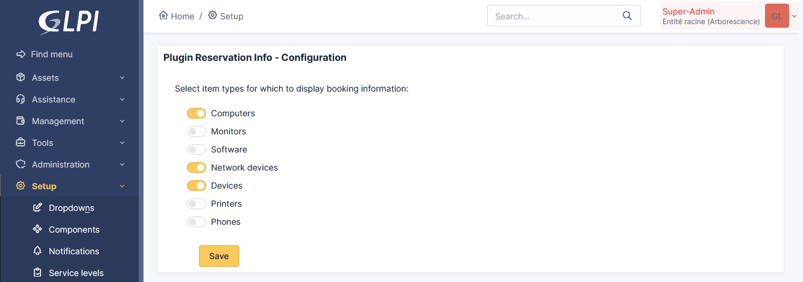

# GLPi Reservation Info Plugin

Download the plugin here : https://github.com/dim00z/ReservationInfo/raw/main/misc/ReservationInfo.zip

## Introduction

The Reservation Info plugin show the current reservation status in lists of items. It works with all types of bookable items: computers, monitors, software, network devices, devices, printers and phones.

## Screenshots




## License


It is distributed under the GNU GENERAL PUBLIC LICENSE Version 3 - please consult the file called [LICENSE](https://raw.githubusercontent.com/dim00z/ReservationInfo/main/LICENSE) for more details.

## Documentation

This plugin is compatible with GLPI 10.0.0 => 10.0.7. Translations available in en_EN, fr_FR, es_ES. It's up to you to add more.
All its database tables and additionnal files are removed when uninstalling the plugin.

## Installation

To install the plugin, unzip files in the following directory:
'glpi/plugins/ReservationInfo/'
then install/enable it from the Setup/plugin panel.

Or use git:

```sh
cd /my/glpi/deployment/main/directory/plugins
git clone https://github.com/dim00z/ReservationInfo.git
```
